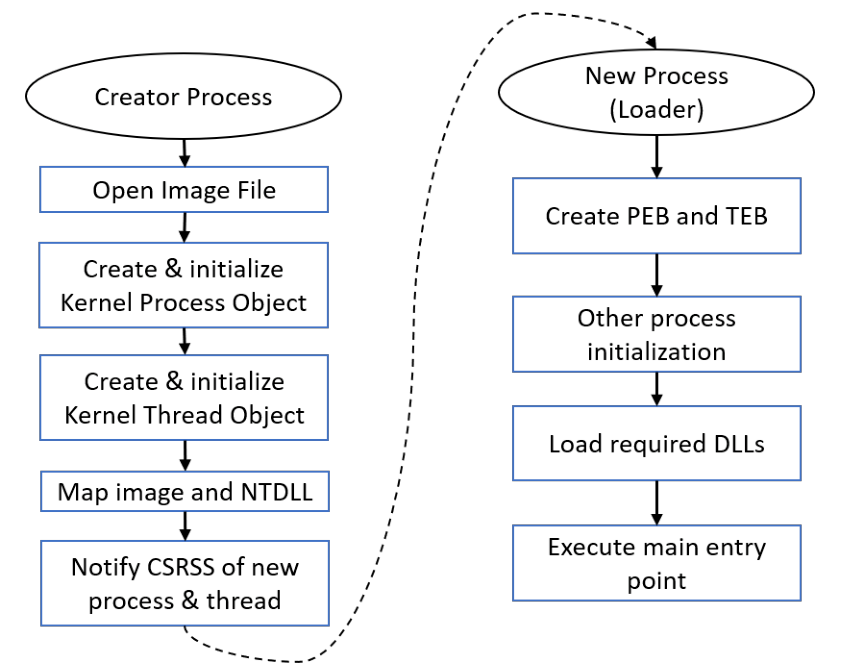
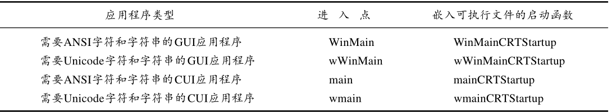
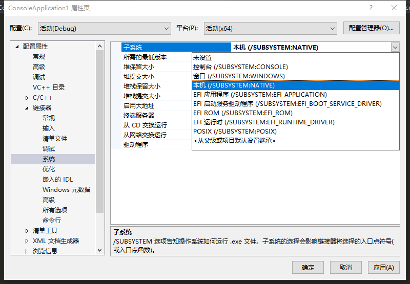
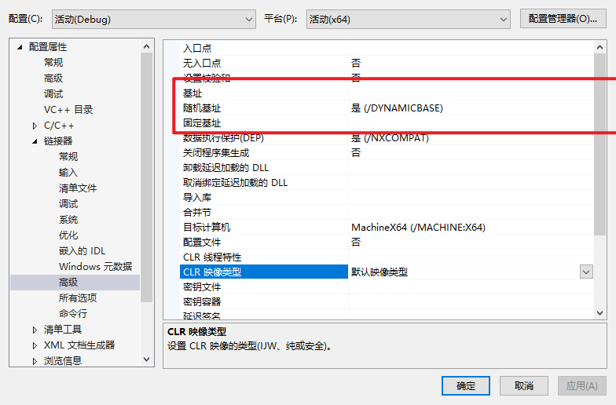

# Processes

## Process basics

在基本的process的基础之上又发展出很多process类型

- Protected processes : 创建之初是为了保护具有数字产权的进程免受别的进程的访问， 管理员进程也不能访问被保护进程的内存空间。
- UWP processes : host the Windows Runtime, and typically are published to the Microsoft Store
  - A UWP process executes inside an AppContainer - a sandbox of sorts that limits the operations this
    process can carry out.

- Protected Processes Light ：PPL，admin-level processes都不能访问其内存。可以使一个第三方服务以PPL进程运行
- Minimal Processes : no executable file mapped into the process address space, and no DLLs , The process address space is truly empty

- Pico Processes: 比minimal process多了一个pico provider, （kernel driver) 可以拦截Linux系统调用转化为等价的Windows系统调用，wsl实现的基础。

> minimal and Pico processes can only be created by the kernel.

PID : 值都是4的倍数，最小的PID是4

>  handles also start with 4 and are multiples of 4

Status : Running, Suspended（暂停） and Not Responding.

GUI process Not Responding ：一个GUI Process至少有一个线程来处理它的与用户的交互，这个thread会有一个消息队列message queue(只要调用任何UI、GDI函数都会有消息队列)，thread通过GetMessage和PeekMessage获取和送出消息队列（也可能是别的API），超过5秒没有任何类似函数调用，系统就会把这个线程判定为Not Responding状态

UWP processes 在move into the background会被暂停

Non-UWP processes that have no GUI are always shown with a Running status，除非这个进程所有的线程都被暂停

可以使用NtSuspendProcess和NtResumeProcessg暂停/重新运行一个thread

进程的session id ：  Session 0 is used for system ， session 1 and higher are used for interactive logins

## Process Creation

### 大致flow



- 通知CSRSS.exe 有新的进程、线程的创建，Csrss  is a helper to the kernel for managing some aspects of Windows subsystem processes

新进程创建完毕

---

- 新进程初始化：

  - NtDll 为新进程创建  Process Environment Block （PEB） （user-mode management object for the process）
  - 和TEB Thread Environment Block ， user mode management object for the thread
    - PEB TEB都在winternl.h

  > 使用NtCurrentTeb() 访问当前线程TEB，通过NtCurrentTeb()->ProcessEnvironmentBlock访问当前进程PEB

  - process heap创建

  - 创建线程池

  - 加载DLLs (DLL hijacking) ,  kernel32.dll, user32.dll, gdi32.dll , advapi32.dll
    - 使用dumpbin可查看加载的dll和函数
    - C:\Program Files (x86)\Microsoft Visual Studio\2019\Community\VC\Tools\MSVC\14.29.30037\bin\Hostx64\x86\dumpbin.exe
    - 使用PE Explorer也可以。
    - API Sets的概念：只提供接口，具体的实现可以在别的地方。通过PEB结构体可以查看到和APISets对象的实现。
    - dll的加载顺序
      1. KnownDLLs
         - HKEY_LOCAL_MA-CHINE\SYSTEM\CurrentControlSet\Control\Session Manager\KnownDLLs
      2. The directory of the executable
      3. The current directory of the process
      4. The System directory returned by GetSystemDirectory ， c:\windows\system32
      5. The Windows directory returned by GetWindowsDirectory ， c:\Windows
      6. The directories listed in the PATH environment variable

    - 调用dll的dllmain函数进行初始化

  - 执行exe的入口函数 （entry point）

    - 初始化C/C++ runtime函数，malloc,new,fopen
    - ...
    - 当所有这些初始化操作完成后， C/C + +启动函数就调用应用程序的进入点函数
    - 运行main函数main/wmain/Winmain/wWinmain

    

    这个可以在项目属性设置

    

    GUI/CUI Application的区别在点函数的不同，启动函数的不同。

    

### main Functions

```c++
int main(int argc, const char* argv[]); // const is optional
int wmain(int argc, const wchar_t* argv[]); // const is optional
int WinMain(HINSTANCE hInstance, HINSTANCE hPrevInstance, LPSTR commandLine, int showCmd);
int wWinMain(HINSTANCE hInstance, HINSTANCE hPrevInstance, LPWSTR commandLine, int showCmd);
```

main和wmain是CUI程序的入口点函数。

winMain和wWinMain是GUI程序的入口点函数。

参数说明：

- argc : 参数个数 >= 1
- argv : 参数数组， argv[0] 为 可执行文件的full path
- hInstance :  it’s the address to which the executable is mapped , 这个值由编译器决定
  - HINSTANCE type == HMODULE type(模块句柄)



- hPrevInstance :  represent the HINSTANCE of a previous instance of the same executable ，通常值为NULL

- commandLine ; cmdline ，但是不包括可执行文件路径，string类型，可以使用下面的api转换为数组。

  ```c++
  #include <ShellApi.h>
  LPWSTR* CommandLineToArgvW(_In_ LPCWSTR lpCmdLine, _Out_ int* pNumArgs);
  // 返回一个指针，指向一个p-string数组
  // pNumArgs : 返回的参数个数
  
  // demo	int count;
  PWSTR* args = CommandLineToArgvW(lpCmdLine, &count);
  WCHAR text[1024] = { 0 };
  for (int i = 0; i < count; i++) {
      ::wcscat_s(text, 1024, args[i]);
      ::wcscat_s(text, 1024, L"\n");
  }
  ::LocalFree(args); // 使用LocalFree来释放内存
  ::MessageBox(nullptr, text, L"Command Line Arguments", MB_OK);
  ```

  - 这个api的特性
    - 如果传的参数是一个empty string，返回的就是full executable path
    - 否则返回的就是一个数组，不包括full executable path
  - GetCommandLine 获得cmdline (string) , 可以传递给CommandLineToArgvw

- showCmd ：如何展示这个application的Window

### Process Environment Variables

The names and values are stored in the Registry (like most system data in Windows) --> 环境变量的值是储存在注册表里的，知识盲区

```
user的环境变量：HKEY_CURRENT_USER\Environment
system的环境变量 ：HKEY_LOCAL_MACHINE\System\Current ControlSet\Control\SessionManager\Environment
```

A process receives environment variables from its parent process （copy )

```c
int main(int argc, char* argv[], const char* env[]); // const is optional
int wmain(int argc, wchar_t* argv[], const wchar_t* env[]); // const is optional
```

获得环境变量的key和value

```c++
int main(int argc, const char* argv[], char* env[]) {
	for (int i = 0; ; i++) {
		if (env[i] == nullptr)
			break;
		// printf("[~]%s", env[i]);
		auto equals = strchr(env[i], '='); // 返回匹配到的地址
		// equals是一个地址
		*equals = '\0'; // 把 = 换成 \0
		printf("%s: %s\n", env[i], equals + 1);
		// printf("[!]%s", env[i]);
		*equals = '=';
	}
	return 0;
}
```

- 上面env是一个string数组，每一个元素的格式是xxx=xxx

```c++
PWSTR env = ::GetEnvironmentStrings(); // GetEnvironmentStrings
WCHAR text[8192] = { 0 };
auto p = env;
while (*p) {
	auto equals = wcschr(p, L'=');
	if (equals != p) {
		// eliminate empty names/values
		wcsncat_s(text, p, equals - p);
		wcscat_s(text, L": ");
		wcscat_s(text, equals + 1);
		wcscat_s(text, L"\n");
	}
	p += wcslen(p) + 1;
}
::FreeEnvironmentStrings(env); // 释放内存
```

获得、改变单个环境变量值

```c++
BOOL SetEnvironmentVariable(
	_In_ LPCTSTR lpName,
	_In_opt_ LPCTSTR lpValue);
DWORD GetEnvironmentVariable(
	_In_opt_ LPCTSTR lpName,
	_Out_ LPTSTR lpBuffer,
	_In_ DWORD nSize);
```

GetEnvironmentVariable经典用法

```c++
std::wstring ReadEnvironmentVariable(PCWSTR name) {
	DWORD count = ::GetEnvironmentVariable(name, nullptr, 0); // 先获取字符串的大小
	if (count > 0) {
		std::wstring value; // 申请一个buffer
		value.resize(count);
		::GetEnvironmentVariable(name, const_cast<PWSTR>(value.data()), count);
        // 获得value
		return value;
	}
	return L"";
}
```

把%windir%\\explorer.exe转换为 c:\windows\explorer.exe

```c++
DWORD ExpandEnvironmentStrings(
	_In_ LPCTSTR lpSrc,
	_Out_opt_ LPTSTR lpDst,
	_In_ DWORD nSize);

WCHAR path[MAX_PATH];
::ExpandEnvironmentStrings(L"%windir%\\explorer.exe", path, MAX_PATH); // MAX_PATH是file PATH的值
printf("%ws\n", path); // c:\windows\explorer.exe
```

### Creating Processes

CreateProcess函数：

```c++
BOOL CreateProcess(
    _In_opt_ PCTSTR pApplicationName, // executable path
    _Inout_opt_ PTSTR pCommandLine,   // command-line arguments
    _In_opt_ PSECURITY_ATTRIBUTES pProcessAttributes, 
    _In_opt_ PSECURITY_ATTRIBUTES pThreadAttributes,
    _In_ BOOL bInheritHandles, 
    _In_ DWORD dwCreationFlags,
    _In_opt_ PVOID pEnvironment, 
    _In_opt_ PCTSTR pCurrentDirectory,
    _In_ PSTARTUPINFO pStartupInfo,
    _Out_ PPROCESS_INFORMATION lpProcessInformation);
```

返回值为BOOL类型，成功返回True。means that from the kernel’s perspective the process and the initial thread have been created successfully。（初始化过程也可能失败）

返回的线程信息：PPROCESS_INFORMATION：

```c++
typedef struct _PROCESS_INFORMATION { 
  HANDLE hProcess; 
  HANDLE hThread; 
  DWORD dwProcessId; // pid
  DWORD dwThreadId;  // tid
} PROCESS_INFORMATION, *PPROCESS_INFORMATION;
```

对于新创建的进程和线程：with all possible permissions unless the new process is protected。拥有user的所有权限。除非被保护。

对于pApplicationName和pCommandLine，有两种写法：

1. pApplicationName为NULL，从pCommandLine中加载程序。可以是相对路径，加载顺序：

```
1. The directory of the caller’s executable
2. The current directory of the process (discussed later in this section)
3. The System directory returned by GetSystemDirectory
4. The Windows directory returned by GetWindowsDirectory
5. The directories listed in the PATH environment variable
```

2. pApplicationName不为NULL，必须为full path。

! cmdline的类型为PTSTR，不能填static String进去。

```c++
CreateProcess(nullptr, L"Notepad", ...); // access violation

WCHAR name[] = L"Notepad"; 
CreateProcess(nullptr, name, ...); // yes
```

pProcessAttributes and pThreadAttributes：指向一个SECURITY_ATTRIBUTES，这个结构里面有安全描述符，继承属性等。

bInheritHandles：是否可继承（global switch）。If FALSE, no handles from the parent process are inherited by the (newly created) child process. If TRUE, all handles that are marked inheritable will be inherited by the child process. （未验证是否设置false后子线程handle再设置true也是不可继承的）

dwCreationFlags：process的标志位。一些有意思的位：

```c++
DEBUG_PROCESS : 标志当前进程的父进程为一个调试器，当前进程及所有的子进程都是被调试进程。
DEBUG_ONLY_THIS_PROCESS : 只有当前进程是被调试进程，子进程不会被调试。
CREATE_PROTECTED_PROCESS : The new process must be run protected
CREATED_PROTECTED_PROCESS : 和上面的差不多，但是要求可执行文件为微软可执行危机。
```

也可以设置线程优先级：

```c++
IDLE_PRIORITY_CLASS 					 4
BELOW_NORMAL_PRIORITY_CLASS 	 6
NORMAL_PRIORITY_CLASS 				 8
ABOVE_NORMAL_PRIORITY_CLASS 	 10
HIGH_PRIORITY_CLASS 					 13
REALTIME_NORMAL_PRIORITY_CLASS 24  // 线程以管理员运行才可以设置这个优先级。
```

pEnvironment：指向环境变量。
pCurrentDirectory：设置当前目录。
可以使用SetCurrentDirectory更改当前目录

```c++
BOOL SetCurrentDirectory( 
  _In_ PCTSTR pPathName);

// 查询
DWORD GetCurrentDirectory(
	_In_ DWORD nBufferLength, 
	_Out_ LPTSTR lpBuffer);
```

pStartupInfo：指向STARTUPINFO或STARTUPINFOEX。新进程的一些设置，包括图形化设置。
使用 GetStartupInfo也可以获得startupinfo。

```c++
typedef struct _STARTUPINFO { 
  DWORD cb; 
  PTSTR lpReserved; 
  PTSTR lpDesktop; 
  PTSTR lpTitle; 
  DWORD dwX; 
  DWORD dwY; 
  DWORD dwXSize; 
  DWORD dwYSize; 
  DWORD dwXCountChars; 
  DWORD dwYCountChars; 
  DWORD dwFillAttribute; 
  DWORD dwFlags; 
  WORD wShowWindow; 
  WORD cbReserved2; 
  PBYTE lpReserved2; 
  HANDLE hStdInput; 
  HANDLE hStdOutput; 
  HANDLE hStdError;
} STARTUPINFO, *PSTARTUPINFO;

typedef struct _STARTUPINFOEX { 
  STARTUPINFO StartupInfo; 
  PPROC_THREAD_ATTRIBUTE_LIST pAttributeList; 
} STARTUPINFOEXW, *LPSTARTUPINFOEXW;

STARTUPINFO si = { sizeof(si) }; 
CreateProcess(..., &si, ...);
```

process create demo code：

```c++
WCHAR name[] = L"notepad"; 

STARTUPINFO si = { sizeof(si) };  // 进程初始化信息
PROCESS_INFORMATION pi; // 接受返回的进程信息

BOOL success = ::CreateProcess(nullptr, name, nullptr, nullptr, FALSE, 0, nullptr, nullptr, &si, &pi); 

if (!success) {
				printf("Error creating process: %d\n", 
       	::GetLastError()); 
} else {
        printf("Process created. PID=%d\n", pi.dwProcessId);
  			// WaitForSingleObject 
  			// 挂起进程
  			::WaitForSingleObject(pi.hProcess, INFINITE);  // INFINITE（-1）一直等下去
  			printf("Notepad terminated.\n");
        ::CloseHandle(pi.hProcess);
        ::CloseHandle(pi.hThread);
}
```

```c++
DWORD rv = ::WaitForSingleObject(pi.hProcess, 10000); 
if (rv == WAIT_TIMEOUT)
	printf("Notepad still running...\n"); 
else if (rv == WAIT_OBJECT_0)
  printf("Notepad terminated.\n"); 
else // WAIT_ERROR (unlikely in this case)
  printf("Error! %d\n", ::GetLastError());
```

#### Handle Inheritance

共享进程句柄的第三种方式：设置bInheritHandles为True，父进程创建子进程的时候会把可继承的进程句柄复制到子进程的句柄表。

如何设置进程可以继承？
a. 创建这个进程的时候设置SECURITY_ATTRIBUTES中的bInheritHandles为true

```c++
SECURITY_ATTRIBUTES sa = { sizeof(sa) }; 
sa.bInheritHandles = TRUE;
HANDLE h = ::CreateEvent(&sa, FALSE, FALSE, nullptr);
// handle h will be inherited by child processes
```

b. 对已存在的进程可以使用SetHandleInformation设置可继承属性

```c++
::SetHandleInformation(h, HANDLE_FLAG_INHERIT , HANDLE_FLAG_INHERIT);
```

c. open函数也可以设置可继承属性（通过共享name共享句柄的方式）

```c++
HANDLE h = ::OpenEvent(EVENT_ALL_ACCESS, TRUE,  L"MyEvent");// inheritable
```

存在的一个问题：子进程不知道它继承了哪些句柄？

可以通过cmdline传递参数来传递句柄。

Demo:

```c++
// 设置可继承属性
::SetHandleInformation(m_hSharedMem.get(), HANDLE_FLAG_INHERIT, HANDLE_FLAG_INHERIT);

// 设置子进程
STARTUPINFO si = { sizeof(si) }; PROCESS_INFORMATION pi;
// build command line 
WCHAR path[MAX_PATH]; 
::GetModuleFileName(nullptr, path, MAX_PATH); // 返回可执行文件 fullpath 到 path
WCHAR handle[16]; // 设置句柄
// 把共享的句柄的value转换为字符串
::_itow_s((int)(ULONG_PTR)m_hSharedMem.get(), handle, 10); // Integer to Wide Char
::wcscat_s(path, L" "); 
::wcscat_s(path, handle); // cmdline 

// 继承的句柄和父进程有相同的句柄value
// Remember that an inherited handle always has the same value as in the original process.
// This is possible because the new process handle table is initially empty, so the entry is definitely unused.

// now create the process
if (::CreateProcess(nullptr, path, nullptr, nullptr, TRUE, 0, nullptr, nullptr, &si, &pi)) {
  // close unneeded handles 
  ::CloseHandle(pi.hProcess); 
  ::CloseHandle(pi.hThread);
}else{
  MessageBox(L"Failed to create new process", L"Inherit Sharing");
}
```

子进程解析：

```c++
int count; 
PWSTR* args = ::CommandLineToArgvW(::GetCommandLine(), &count); // GetCommandLine()获取参数
// CommandLineToArgvW用来解析cmdline
if (count == 1) {
	// "master" instance
	m_hSharedMem.reset(::CreateFileMapping(INVALID_HANDLE_VALUE,nullptr, PAGE_READWRITE, 0, 1 << 16, nullptr)); 
  // CreateFileMapping 创建一个共享内存
}else{
  // first "real" argument is inherited handle value
  m_hSharedMem.reset((HANDLE)(ULONG_PTR)::_wtoi(args[1]));
}
::LocalFree(args);
```

#### Process Drive Directories

使用SetCurrentDirectory和GetCurrentDirectory可设置和得到当前目录，对相对路径运行的process，会先从这个directory加载文件。

对：c:mydata.txt ， 可以使用GetFullPathName获取fullpath 

```c++
DWORD GetFullPathNameW(
  _In_ LPCWSTR lpFileName, 
  _In_ DWORD nBufferLength, 
  _Out_ LPWSTR lpBuffer, 
  _Outptr_opt_ LPWSTR* lpFilePart);
```

```c++
WCHAR path[MAX_PATH];
::GetFullPathName(L"c:mydata.txt", MAX_PATH, path, nullptr);
// 返回 c:Win10SysProg\mydata.txt
```

使用GetEnvironmentStrings可以看到返回

=C:=C:\Dev\Win10SysProg 
=D:=D:\Temp

#### Process (and Thread) Attributes

STARTUPINFO信息，可以对这个结构进行扩展：STARTUPINFOX

```c++
typedef struct _STARTUPINFOEX { 
  STARTUPINFO StartupInfo; 
  PPROC_THREAD_ATTRIBUTE_LIST pAttributeList; // 指向一个属性列表
} STARTUPINFOEXW, *LPSTARTUPINFOEXW;
```

创建一个STARTUPINFOX结构体的步骤如下：

1. Allocate and initialize an attribute list with InitializeProcThreadAttributeList.

```c++
BOOL InitializeProcThreadAttributeList(
	_Out_ PPROC_THREAD_ATTRIBUTE_LIST pAttributeList,
  _In_ DWORD dwAttributeCount, 
  _Reserved_ DWORD dwFlags, // must be zero 
  PSIZE_T pSize);
```

demo: 调用两次InitializeProcThreadAttributeList

```c++
SIZE_T size; // get required size 
::InitializeProcThreadAttributeList(nullptr, 1, 0, &size); // allocate the required size auto 
attlist = (PPROC_THREAD_ATTRIBUTE_LIST)malloc(size); // initialize 
::InitializeProcThreadAttributeList(attlist, 1, 0, &size); // just one attribute
```

2. Add attributes as required by calling UpdateProcThreadAttribute once for each attribute.

```c++
BOOL UpdateProcThreadAttribute(
	_Inout_ PPROC_THREAD_ATTRIBUTE_LIST pAttributeList, 
  _In_ DWORD dwFlags, // must be zero 
  _In_ DWORD_PTR Attribute, 
  _In_ PVOID pValue, 
  _In_ SIZE_T cbSize, 
  _Out_ PVOID pPreviousValue, // must be NULL 
  _In_opt_ PSIZE_T pReturnSize); // must be NULL
```

demo: 通过PROC_THREAD_ATTRIBUTE_PARENT_PROCESS设置这个进程的父进程

```c++
HANDLE hParent = ...;
::UpdateProcThreadAttribute(attlist, 0, PROC_THREAD_ATTRIBUTE_PARENT_PROCESS,&hParent, sizeof(hParent), nullptr, nullptr);
```

> 多个Attribute如何调用这个API？

3. Set the pAttribute member of STARTUPINFOEX to point to the attribute list.

4. Call CreateProcess with the extended structure, not forgetting to add the flag EXTENDED_STARTUPINFO_PRESENT to the creation flags (sixth parameter to CreateProcess)

```c++
STARTUPINFOEX si = { sizeof(si) }; 
si.lpAttributeList = attlist; 	// 指针指向
PROCESS_INFORMATION pi; 
// 4. 需要设置EXTENDED_STARTUPINFO_PRESENT标志位，不设置不生效。
WCHAR name[] = L"Notepad";
::CreateProcess(nullptr, name, nullptr, nullptr, FALSE, EXTENDED_STARTUPINFO_PRESENT, nullptr, nullptr, (STARTUPINFO*)&si, &pi);
```

5. Delete the attribute list with DeleteProcThreadAttributeList.

```c++
::DeleteProcThreadAttributeList(attList); 
::free(attList);
```

完整demo:

```c++
DWORD CreateProcessWithParent(PWSTR name, DWORD parentPid) {
	HANDLE hParent = ::OpenProcess(PROCESS_CREATE_PROCESS, FALSE, parentPid); 
  if (!hParent) return 0;

	PROCESS_INFORMATION pi = { 0 }; 
  PPROC_THREAD_ATTRIBUTE_LIST attList = nullptr;

	do {
    SIZE_T size = 0; 
    ::InitializeProcThreadAttributeList(nullptr, 1, 0, &size); 
    if (size == 0) break;

		attList = (PPROC_THREAD_ATTRIBUTE_LIST)malloc(size); 
    if (!attList) break;

		if (!::InitializeProcThreadAttributeList(attList, 1, 0, &size)) break;

		if (!::UpdateProcThreadAttribute(attList, 0, PROC_THREAD_ATTRIBUTE_PARENT_PROCESS, &hParent, sizeof(hParent), nullptr, nullptr)) break;

		STARTUPINFOEX si = { sizeof(si) }; 
    si.lpAttributeList = attList; 
    if (!::CreateProcess(nullptr, name, nullptr, nullptr, FALSE, EXTENDED_STARTUPINFO_PRESENT, nullptr, nullptr, (STARTUPINFO*)&si,&pi)) // EXTENDED_STARTUPINFO_PRESENT
      break;  
  ::CloseHandle(pi.hProcess); ::CloseHandle(pi.hThread); 
} while (false);

	::CloseHandle(hParent); 
	if (attList) {
		::DeleteProcThreadAttributeList(attList);
		::free(attList); 
	} 
  return pi.dwProcessId;
}
```

Demo2: 设置 PROC_THREAD_ATTRIBUTE_MITIGATION_POLICY。 process mitigations

```c++
DWORD CreateProcessWithMitigations(PWSTR name, DWORD64 mitigation) { 
  PROCESS_INFORMATION pi = { 0 }; 
  PPROC_THREAD_ATTRIBUTE_LIST attList = nullptr;
	do {
		SIZE_T size = 0; 
    ::InitializeProcThreadAttributeList(nullptr, 1, 0, &size); 
    if (size == 0) break;

		attList = (PPROC_THREAD_ATTRIBUTE_LIST)malloc(size); 
    if (!attList) break;

		if (!::InitializeProcThreadAttributeList(attList, 1, 0, &size)) break;

		if (!::UpdateProcThreadAttribute(attList, 0, PROC_THREAD_ATTRIBUTE_MITIGATION_POLICY, &mitigation, sizeof(mitigation), nullptr, nullptr)) break;

		STARTUPINFOEX si = { sizeof(si) }; 
    si.lpAttributeList = attList; 
    if (!::CreateProcess(nullptr, name, nullptr, nullptr, FALSE, EXTENDED_STARTUPINFO_PRESENT, nullptr, nullptr, (STARTUPINFO*)&si, &pi)) break; 
    ::CloseHandle(pi.hProcess); 
    ::CloseHandle(pi.hThread); 
  } while (false);
	if (attList) { 
    ::DeleteProcThreadAttributeList(attList); ::free(attList); 
  } 
  return 	pi.dwProcessId;
}


WCHAR name[] = L"notepad"; 
auto pid = CreateProcessWithMitigations(name, PROCESS_CREATION_MITIGATION_POLICY_WIN32K_SYSTEM_CALL_DISABLE_ALWAYS_ON);
```

 the specific mitigation prevents calls to Win32k.sys，可以拦截系统调用。

#### Protected and PPL Processes

Protected Processes Light

最初设置是为了数字版权

Only Microsoft-signed executables with a certain Extended Key Usage (EKU) were allowed to execute protected.
access masks：PROCESS_QUERY_LIMITED_INFORMATION, PROCESS_SET_LIMITED_INFORMATION, PROCESS_SUSPEND_RESUME and PROCESS_TERMINATE.

windows8之后扩展：Protected Processes Light (PPL),

- higher level protected processes have full access to lower level ones
- possible to run third party anti-malware services
- Protected and PPL processes cannot load arbitrary DLLs,All DLLs loaded by protected/PPL processes must be signed properly

通过限制access mask保护进程

ppl levels:


创建ppl进程： CREATE_PROTECTED_PROCESS 标志位

> Windows Internals 7th edition Part 1 cp3

#### UWP Processes

Universal Windows Platform processes

- run under AppContainer (limits what it can do and what it can access)
- managed by the Process Lifetime Manager (PLM)

- 受foreground/background影响
- 单例
- Microsoft Store--微软商店应用，适配所有Windows平台的应用。

通过包（可执行文件，DLL，资源文件）创建进程, 不能直接通过命令行运行，会提示缺少包名称。可以调用COM接口等指定包名称创建进程。 调用Windows runtime API创建UWP进程。

调用Windows Runtime API的方法：

1. Directly, by instantiating the proper classes and working with the low level object factories until an instance is created and then use normal COM calls.

2. Use the Windows Runtime Library (WRL) C++ wrappers and helpers. 

3. Use the C++/CX language extensions, that provide an easy access to WinRT by extending C++ in a non-standard way.

4. Use the CppWinRT library, that provides relatively easy access to the WinRT APIs with standard C++ only. 

优先考虑2，3，4

使用4 CppWinRT 创建UWP进程：

导入包和命名空间

```c++
#include <winrt/Windows.Foundation.h> 
#include <winrt/Windows.Foundation.Collections.h> 
#include <winrt/Windows.ApplicationModel.h> 
#include <winrt/Windows.Management.Deployment.h> 
#include <winrt/Windows.Storage.h>

using namespace winrt; 
using namespace winrt::Windows::Management::Deployment; 
using namespace winrt::Windows::ApplicationModel;
```

使用 winrt::Windows::Management::Deployment 下的PackageMangement枚举可用包：

```c++
auto packages = PackageManager().FindPackagesForUser(L""); // L"" -> 当前用户

for (auto package : packages) {
	auto item = std::make_shared<AppItem>();
  /*
  struct AppItem { 
    CString Name, Publisher, InstalledLocation, FullName; 
    winrt::Windows::ApplicationModel::PackageVersion Version; 
    winrt::Windows::Foundation::DateTime InstalledDate; bool IsFramework; 
  };*/
  
	item->InstalledLocation = package.InstalledLocation().Path().c_str(); 
  item->FullName = package.Id().FullName().c_str(); 
  item->InstalledDate = package.InstalledDate(); 
  item->IsFramework = package.IsFramework(); 
  item->Name = package.Id().Name().c_str(); 
  item->Publisher = package.Id().Publisher().c_str(); 
  item->Version = package.Id().Version();
	m_AllPackages.push_back(item);
}
```

CView::RunApp

```c++
bool CView::RunApp(PCWSTR fullPackageName) {
	PACKAGE_INFO_REFERENCE pir; 
  int error = ::OpenPackageInfoByFullName(fullPackageName, 0, &pir); // pir
  if (error != ERROR_SUCCESS) return false;
  
  // 根据app id调用包里面的application
  UINT32 len = 0; 
  error = ::GetPackageApplicationIds(pir, &len, nullptr, nullptr); // 获取size
  if (error != ERROR_INSUFFICIENT_BUFFER) break;

	auto buffer = std::make_unique<BYTE[]>(len); 
  UINT32 count; 
  error = ::GetPackageApplicationIds(pir, &len, buffer.get(), &count);  // buffer
  if (error != ERROR_SUCCESS) break;
  
  // 启动
  CComPtr<IApplicationActivationManager> mgr; 
  auto hr = mgr.CoCreateInstance(CLSID_ApplicationActivationManager); 
  // 通过IApplicationActivationManager创建实例
  if (FAILED(hr)) break;

	DWORD pid; 
  // 激活
  hr = mgr->ActivateApplication((PCWSTR)(buffer.get() + sizeof(ULONG_PTR)), //skip the first 4 bytes
                                
                                nullptr, AO_NOERRORUI, &pid);
  
  // 释放
  ::ClosePackageInfo(pir);
}
```

UWP进程的父进程为Svchost.exe（DCOM Launch service）


