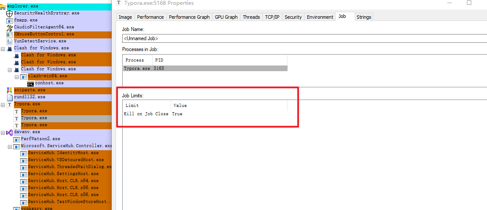

# Chapter 4: Jobs

Job objects : being able to manage one or more processes --> around limiting the managed processes

On Windows 7 and earlier, a process can be a member of a single job only, while in Windows 8 and later, a process can be associated with multiple jobs. 多对一变多对多。

## about jobs

可以在Process Explorer 的 Options / Configure Colors标记jobs颜色为棕色。

jobs中的进程会受到一些限制：



## creating jobs

```c++
HANDLE CreateJobObject( 
    _In_opt_ LPSECURITY_ATTRIBUTES	pJobAttributes,
    _In_opt_ LPCTSTR	pName // object name
);
```

pName: if a name is provided, and a job with that name exists, then (barring security restrictions), another handle to the existing job is returned

```c++
HANDLE OpenJobObject( 
    _In_ DWORD dwDesiredAccess,  // access mask
    _In_ BOOL bInheritHandle, 
    _In_ PCTSTR pName
);
```

dwDesiredAccess : This access mask is checked against the security descriptor of the job object。returning success only if the security descriptor includes entries that allow the requested permissions。

常用的access mask：

```c++
JOB_OBJECT_QUERY (4) 查询权限
JOB_OBJECT_ASSIGN_PROCESS (1) 向job增加进程权限
JOB_OBJECT_SET_ATTRIBUTES (0x10) 
JOB_OBJECT_ALL_ACCESS 所有权限
```

向job增加进程： 

```c++
AssignProcessToJobObject(
    _In_ HANDLE hJob, 
    _In_ HANDLE hProcess);
```

对job的权限要求： access mask存在 JOB_OBJECT_ASSIGN_PROCESS

对被加入的process的要求: PROCESS_SET_QUOTA 和 PROCESS_TERMINATE access mask bits

```c++
bool AddProcessToJob(HANDLE hJob, DWORD pid) {
	HANDLE hProcess = ::OpenProcess(PROCESS_SET_QUOTA | PROCESS_TERMINATE, FALSE, pid); 
	if (!hProcess) 
		return false;
	BOOL success = ::AssignProcessToJobObject(hJob, hProcess); 
	::CloseHandle(hProcess); 
	return success ? true : false;
}
```

对于jobs内的进程创建的子进程一般都还属于job。break out的情况：

1. job has the limit flag JOB_OBJECT_LIMIT_SILENT_BREAKAWAY_OK.
2. CreateProcess call includes the CREATE_BREAKAWAY_FROM_JOB flag  AND job allows breaking out of it ( JOB_OBJECT_LIMIT_BREAKAWAY_OK )

## Nested Jobs

Windows 8 introduced the ability to associate a process with more than one job.

The second job becomes a child of the first job

rules:

1. A limit imposed by a parent job affects the job and all child jobs

2. Any limit imposed by a parent job cannot be removed by a child job, but it can be more strict

[JobTree : ](./jobTree.cpp)


## Querying Job Information

