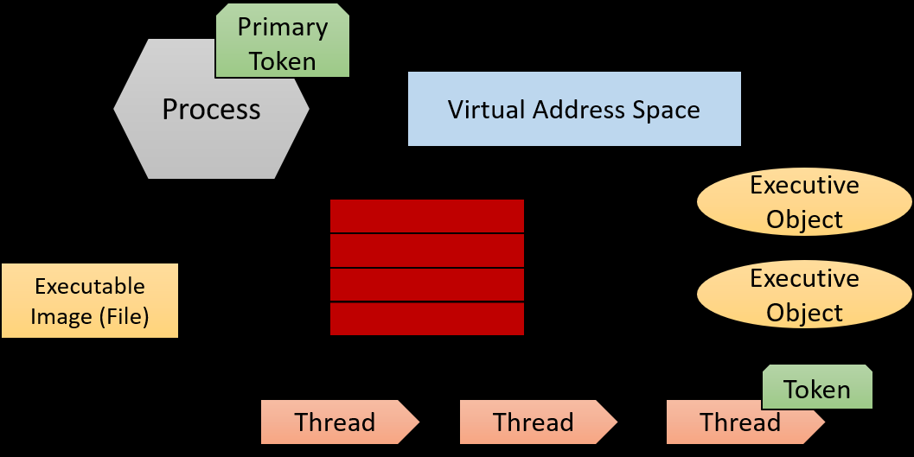
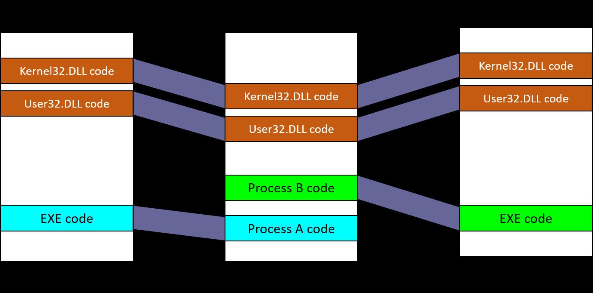
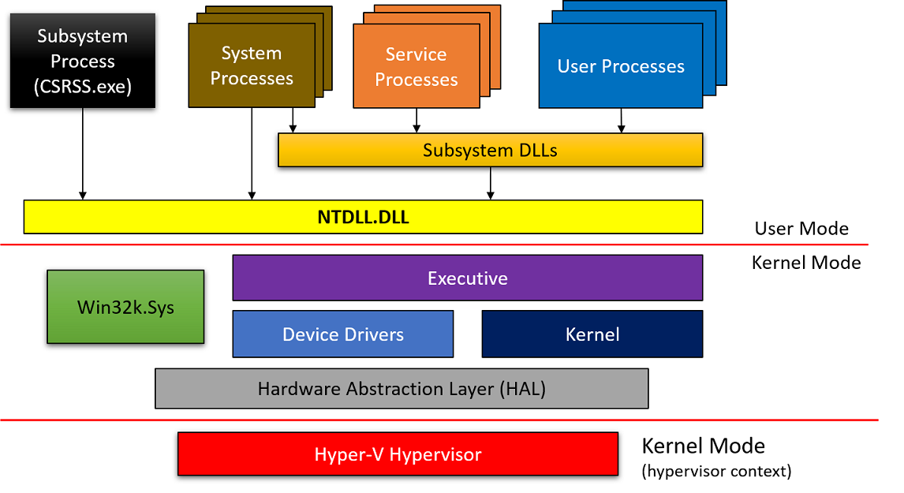
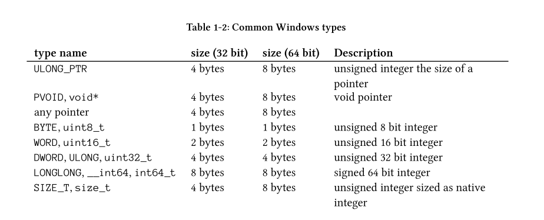
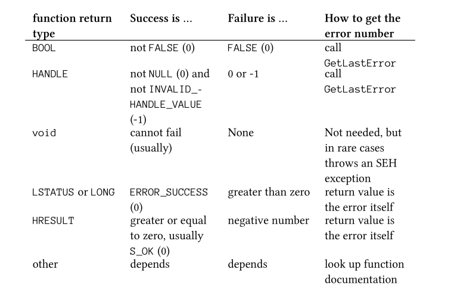
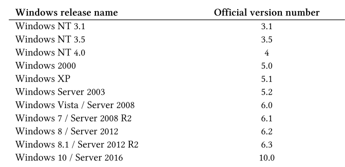
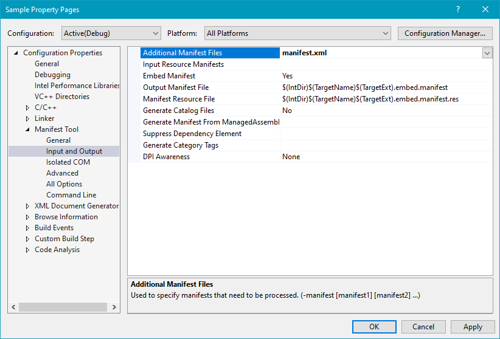

# Chapter 1 HelloWorld

SampleCode https://github.com/zodiacon/Win10SysProgBookSamples

## Windows Architecture Overview

#### Process

- A process is a containment and management object that represents a running instance of a program.
  - Processes don’t run -- processes manage
  - Threads are the ones that execute code and technically run
- Process
  - An executable program
  - A private virtual address space
  - An access token
  - A private handle table 
  - One or more threads of execution



#### Dynamic Link Libraries

- static linking -> loaded dynamically
- dynamic linking ->  explicitly requested

Windows DLLs stored in the System32 directory.



#### Virtual Memory

- the executable image and NtDll.Dll are normally the first to be mapped
- other processes cannot access it directly
- the first 64KB of address cannot be allocated

#### Threads

- Current access mode, either user or kernel.
- Execution context, including processor registers.
- **A stack** , used for local variable allocations and call management.
- Thread Local Storage (TLS) array, which provides a way to store thread-private data with uniform access semantics.
-  Base priority and a current (dynamic) priority.
- Processor affinity, indicating on which processors the thread is allowed to run on.
- 三种状态
  - Running - currently executing code on a (logical) processor.
  - Ready - waiting to be scheduled for execution （ all relevant processors are busy or unavailable.）
  - Waiting  -  waiting for some event to occur before proceeding.

#### General System Architecture

- Technically, starting from Windows 8.1, there is only a single subsystem - the Windows Subsystem.
-  Device Drivers ： Device drivers are loadable kernel modules

#### Windows Application Development

- Windows API
- Component Object Model (COM) technology : COM API

扩展的组件

- Microsoft Foundation Classes (MFC) （Windows UI)
- Active Template Library (ATL)  a C++ template-based library geared towards building COM servers and clients.
- Windows Template Library* (WTL)   an extension to ATL, 加入了UI
- .NET - a framework and a runtime (Common Language Runtime - CLR) that provide a host of services
- Windows Runtime (WinRT) - 



## working with strings

### Strings/Char in Classic C: 

- Chars : 8 bit Ascii
- Strings are just pointers to characters that end with a zero

### Strings/Char in Windows API: 

- Chars : multiple character sets from many languages -- Unicode

  - Unicode: utf --- Unicode Transformation Format.
    - UTF-8 : 用单字节表示ascii,多字节表示汉字等别的字符。每一个字符可能是1-4字节。如果英文单词比较多用utf-8表示比较好。
    - utf-16: 通常使用两个字节表示一个字符。少数字符如汉语或日语的一些使用4字节。
    - utf-32 : 每一个字符都使用4个字节。

  - 编程优先考虑使用utf-16
    - windows内核使用的是utf-16
    - Windows api 兼容utf-8和utf-16 (历史原因)

    以具体函数举例 `CreateMutex`、CreateMutex只是一个宏，具体可被定义为CreateMutexA和CreateMutexW

    函数原型

    ```c
    HANDLE CreateMutex(
    _In_opt_ 	LPSECURITY_ATTRIBUTES 	lpMutexAttributes,
    _In_ 		BOOL 					bInitialOwner,
    _In_opt_ 	LPCTSTR 				lpName);
    ```

    >  \_In\_opt\_ : Syntax Annotation Language 用来标记元数据。编译器会完全忽略但是静态分析器会用到。

    LPCTSTR ：L=Long P=Pointer C=Constant STR=String 。 L只在16进制操作系统有意义。现在的指针都是一个size,没有long,short之分

    LPCTSTR 类型定义如下, 宏的定义根据UNICODE宏是否定义

    ```c++
    typedef LPCSTR LPCTSTR;  // const char* (UNICODE not defined)
    typedef LPCWSTR LPCTSTR; // const wchar_t* (UNICODE defined)
    ```

    - .NET只使用 utf-16

TCHAR 

- ascii ：char
- unicode : wchar_t

定义wideChar: 加`L`

```c
const char name1[] = "Hello"; 	// 6字节 5+1
const wchar_t name2[] = L"Hello"; // 12个字节 10+2
```

TEXT宏 ：根据UNICODE宏是否定义来确定一个字符串是一个宽字节字符串还是ASCII

```c
HANDLE hMutex = ::CreateMutex(nullptr, FALSE, TEXT("MyMutex"));
```

或者使用`_T`

```c
include <tchar.h>
HANDLE hMutex = ::CreateMutex(nullptr, FALSE, _T("MyMutex"));
```

### Strings in c/c++ Runtime

>  what is c/c++ Runtime functions : strlen,malloc ...

- ASCII : strlen , strcpy , strcat (str
- UINCODE : wcslen, wcscpy , wcscat (wcs
- 宏定义 : _UNICODE 。
  - `_tcs` : _tcslen _tcscpy _tcscat

### 函数返回值 

receiving results in the form of strings . api举例。

1. 调用这个函数的代码申请一个（allocate）buffer ，把buffer传递给api, api返回的时候把返回字符copy到这个buffer里面

GetSystemDirectory :  The function accepts a string buffer and its size and returns the number of characters written back 

> size : number of chars

```c
UINT GetSystemDirectory(
	_Out_ LPTSTR lpBuffer,
	_In_  UINT 	 uSize);
```

```c
// MAX_PATH is defined in the Windows headers as 260 (standard maximum path in Windows)
WCHAR path[MAX_PATH];
::GetSystemDirectory(path, MAX_PATH);
printf("System directory: %ws\n", path); // %ws 
```

2. The second common case is where the client code provides a string pointer only (via its address) and the API itself allocates the memory and places the resulting pointer in the provided variable.

api负责申请和释放内存

e.g. FormatMessageW

```c
DWORD FormatMessageW(
_In_ DWORD dwFlags,
_In_opt_ LPCVOID lpSource,
_In_ DWORD dwMessageId,
_In_ DWORD dwLanguageId,
_When_((dwFlags & FORMAT_MESSAGE_ALLOCATE_BUFFER) != 0, _At_((LPWSTR*)lpBuffer, _Outptr_result_z_))
_When_((dwFlags & FORMAT_MESSAGE_ALLOCATE_BUFFER) == 0, _Out_writes_z_(nSize))
 LPWSTR lpBuffer,
_In_ DWORD nSize,
_In_opt_ va_list *Arguments);
```

lpBuffer传的值取决于dwFlags

- 如果设置 FORMAT_MESSAGE_ALLOCATE_BUFFER ：FormatMessageW 会自动申请和释放空间，lpBuffer只需要传一个指针即可。
- 如果未设置：需要传一个指针并指向一个空间。

### safe String Functions

如 strcpy(); 可能就会出现缓冲区溢出的bug. 有增强版的api strcpy_s, wcscat_s etc. 这些api额外有一个参数可以设置目标缓冲区的最大大小。

e.g. (C/C++ Runtime)

```c
WCHAR buffer[32];
wcscpy_s(buffer, argv[1]);
WCHAR* buffer2 = (WCHAR*)malloc(32 * sizeof(WCHAR));
//wcscpy_s(buffer2, argv[1]);
wcscpy_s(buffer2, 32, argv[1]);
// size in characters (not bytes)
free(buffer2);
```

WindowsApi也有对应的api 在`<strsafe.h>`

```c
#include <strsafe.h>
StringCchCopy(buffer, _countof(buffer), argv[1]);
StringCchCat(buffer, _countof(buffer), L"cat");
StringCchCopy(buffer2, 32, argv[1]);
StringCchCat(buffer2, 32, L"cat");
```

> “Cch” stands for Count of Characters.

使用 `_countof` 宏来计算buffer的大小 // sizeof(a)/sizeof(a[0]) 算出char的number

### 32bit / 64bit

32bit下指针只有4字节，64bit下指针有8字节。所以无法用int表示64位指针的值。int 4字节

可以用INT_PTR

```c
void* p = ...;
INT_PTR value = (INT_PTR)p;
// do something with value
```

windows类型的扩展:



32位进程可以在64位操作系统上执行：WOW64 (Windows on Windows 64). 

`_WIN64`宏 ：

```c
#ifdef _WIN64
printf("Processor Mask: 0x%016llX\n", si.dwActiveProcessorMask);
#else
printf("Processor Mask: 0x%08X\n", si.dwActiveProcessorMask);
#endif
```

## Coding Conventions

- Windows API都以双冒号`::` 开头 ： :: CreateFile
- 类型名称遵循帕斯卡命名法 SolidBrush ， Book
  - WTL 以C开头 （Windows Template Library）
- 私有成员变量 以 `_`开头 _Book _Size 
  - WTL 以 m_开头
- 函数名使用帕斯卡命名法  每一个单词开头大写。
- WTL : Windows Template Library -> simplify UI-related code.
- WIL : Windows Implementation Library  :  This library contains helpful types for easier working with the
  Windows API.

- Hungarian notation : uses prefixes to make variable names hint at their type. Examples: szName, dwValue. 现在已经废用，但是Windows api里面还有很多。


## handling API Errors



BOOL type : 32 bit singed integer.

使用GetLastError API获得当前线程上一次调用api失败的ErrorCode. ErrorCode可以使用FormatMessage API获得具体信息。

```c++
BOOL success = ::CallSomeAPIThatReturnsBOOL();
if(!success) {
// error - handle it (just print it in this example)
printf("Error: %d\n", ::GetLastError());
}
```

LSTATUS/LONG : 32位的整数 success返回0，失败会返回errorcode

HRESULT ：32位整数。 success返回整数，failed返回复数。

自定义ErrorCode

```c++
#define MY_ERROR_1 ((1 << 29) | 1)
#define MY_ERROR_2 ((1 << 29) | 2)
BOOL SomeApi1(int32_t, int32_t*);
BOOL SomeApi2(int32_t, int32_t*);
bool DoWork(int32_t value, int32_t* result) {
	int32_t result1;
	BOOL ok = ::SomeApi1(value, &result1);
	if (!ok) {
		::SetLastError(MY_ERROR_1);
		return false;
	}
	int32_t result2;
	ok = ::SomeApi2(value, &result2);
	if (!ok) {
		::SetLastError(MY_ERROR_2);
		return false;
	}
	*result = result1 + result2;
	return true;
}
```

第29位设置为1，防止和系统的ErrorCode冲突

## GetWindowsVersion

versionCode



API GetVersionEx()

```c++
typedef struct _OSVERSIONINFO {
	DWORD dwOSVersionInfoSize;
	DWORD dwMajorVersion;
	DWORD dwMinorVersion;
	DWORD dwBuildNumber;
	DWORD dwPlatformId;
	TCHAR
		szCSDVersion[128];
	// Maintenance string for PSS usage
} OSVERSIONINFO, * POSVERSIONINFO, * LPOSVERSIONINFO;

BOOL GetVersionEx(
_Inout_ POSVERSIONINFO pVersionInformation);
```

调用：初始化_OSVERSIONINFO结构体的时候把size初始化一下即可。

```c++
OSVERSIONINFO vi = { sizeof(vi) };
::GetVersionEx(&vi);
printf("Version: %d.%d.%d\n", vi.dwMajorVersion, vi.dwMinorVersion, vi.dwBuildNumber);
```

Windows10下运行是 Version: 6.2.9200 。（保证兼容性）

高版本Windows  在资源文件添加 manifest.xml 

```c++
<?xml version="1.0" encoding="utf-8"?>
<assembly manifestVersion="1.0" xmlns="urn:schemas-microsoft-com:asm.v1">
	<compatibility xmlns="urn:schemas-microsoft-com:compatibility.v1">
		<application>
			<!-- Windows Vista -->
			<!--<supportedOS Id="{e2011457-1546-43c5-a5fe-008deee3d3f0}" />-->
			<!-- Windows 7 -->
			<!--<supportedOS Id="{35138b9a-5d96-4fbd-8e2d-a2440225f93a}" />-->
			<!-- Windows 8 -->
			<!--<supportedOS Id="{4a2f28e3-53b9-4441-ba9c-d69d4a4a6e38}" />-->
			<!-- Windows 8.1 -->
			<!--<supportedOS Id="{1f676c76-80e1-4239-95bb-83d0f6d0da78}" />-->
			 <!--Windows 10--> 
			<supportedOS Id="{8e0f7a12-bfb3-4fe8-b9a5-48fd50a15a9a}" />
		</application>
	</compatibility>
</assembly>
```

配置项目属性



然后再运行得到的Windows版本就是Version: 10.0.19042

> 没搞懂。

使用KUSER_SHARED_DATA 结构体获取Windows系统版本 ，在固定的地址处：0x7FFE0000

> 结构体定义  https://docs.microsoft.com/en-us/windows-hardware/drivers/ddi/content/ntddk/ns-ntddk-kuser_shared_data

```c
auto sharedUserData = (BYTE*)0x7FFE0000;
// 自动类型推断，auto的自动类型推断发生在编译期，所以使用auto并不会造成程序运行时效率的降低。
printf("Version: %d.%d.%d\n",
       *(ULONG*)(sharedUserData + 0x26c),
       // major version offset
       *(ULONG*)(sharedUserData + 0x270),
       // minor version offset
       *(ULONG*)(sharedUserData + 0x260)); // build number offset (Windows 10)
```

使用`<versionhelpers.h>`里面预定义的和版本有关的api:

IsWindowsXPOrGreater,IsWindowsXPSP3OrGreater, IsWindows7OrGreater, IsWindows8Point1OrGreater,IsWindows10OrGreater

使用VerifyVersionInfo也可以判断一个系统的版本号是否符合需求。

```c
BOOL VerifyVersionInfo(
_Inout_ POSVERSIONINFOEX pVersionInformation, // 这个结构里保存用户提供的系统版本信息
_In_ 	DWORD dwTypeMask, //  类型掩码，是由一些宏进行或操作之后的结果
_In_ 	DWORDLONG dwlConditionMask); // 条件掩码
```

## Exercises

#### GetNativeSystemInfo() API的使用

```c
#define BUILD_WINDOWS
#include<windows.h>
#include<stdio.h>

int main()
{
	SYSTEM_INFO si;
	GetNativeSystemInfo(&si);
	printf("Number of Processors: %d\n", si.dwNumberOfProcessors);
	printf("size of dwPageSize: %d\n", si.dwPageSize);
	printf("ProcessorType: %d\n", si.dwNumberOfProcessors);
	printf("ProcessorLevel: %d\n", si.wProcessorLevel);
	printf("MinimumApplicationAddres: %p\n", si.lpMinimumApplicationAddress);
	printf("MaximumApplicationAddress: %p\n", si.lpMaximumApplicationAddress);
	return 0;
}
```

#### GetComputerName|GetUserName

```c
BOOL GetComputerNameA(
  LPSTR   lpBuffer, //返回当前电脑名称
  LPDWORD nSize     //返回名称的size
);
BOOL GetUserNameW(
  LPWSTR  lpBuffer,
  LPDWORD pcbBuffer
);
```

```c++
#define BUILD_WINDOWS
#include<windows.h>
#include<stdio.h>

int main()
{	
	DWORD size1 = 0;
	DWORD size2 = 0;
	GetComputerName(NULL,&size1);
	wchar_t* ComputerName = new wchar_t[size1];
	GetUserName(NULL, &size2);
	wchar_t* UserName = new wchar_t[size2];

	GetComputerName(ComputerName, &size1);
	GetUserName(UserName, &size2);
	printf("%ws/%ws", ComputerName,UserName);
	delete[]ComputerName;
	delete[]UserName;
	return 0;
}
```

或者

```c++
#define BUILD_WINDOWS
#include<windows.h>
#include<stdio.h>

int main()
{	
	DWORD size = 0;

	GetComputerName(NULL,&size);
	wchar_t* ComputerName = new wchar_t[size];
	size = 0;
	GetUserName(NULL, &size);
	wchar_t* UserName = new wchar_t[size];

	GetComputerName(ComputerName, &size);
	GetUserName(UserName, &size);
	printf("%ws/%ws", ComputerName,UserName);
	delete[]ComputerName;
	delete[]UserName;
	return 0;
}
```


#### GetWindowsDirectory

[GetWindowsDirectoryA function (sysinfoapi.h) - Win32 apps | Microsoft Docs](https://docs.microsoft.com/en-us/windows/win32/api/sysinfoapi/nf-sysinfoapi-getwindowsdirectorya)

```c
UINT GetWindowsDirectoryA(
  LPSTR lpBuffer,
  UINT  uSize
);
```

```c
#define BUILD_WINDOWS
#include<windows.h>
#include<stdio.h>

int main()
{
	wchar_t Directory[MAX_PATH];
	GetWindowsDirectory(Directory, MAX_PATH);
	printf("%ws", Directory);
	return 0;
}
```

