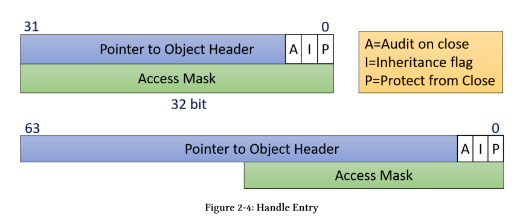
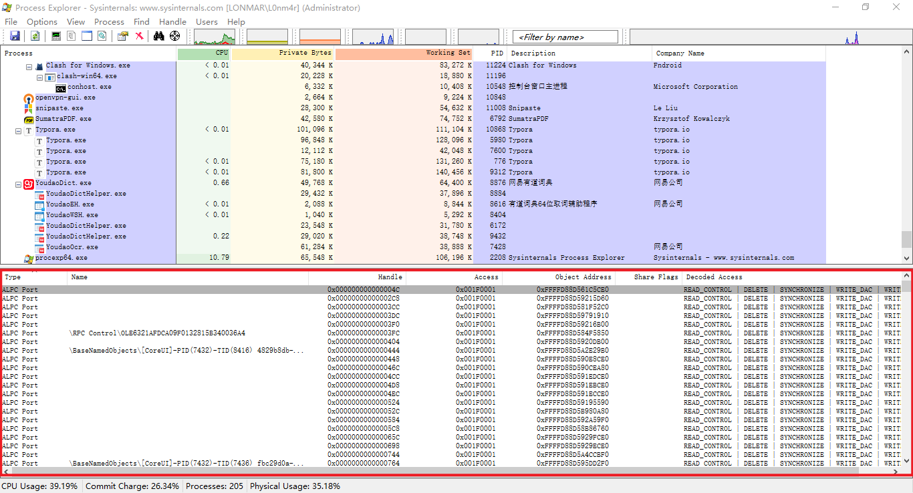
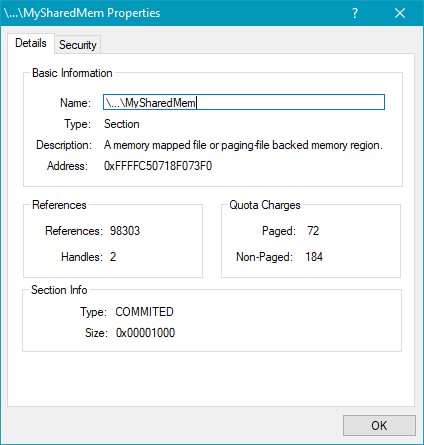

# Chapter 2: Objects and Handles

### Kernel Objects

Windows kernel exposes various types of objects for use

Applications使用handlers访问内核对象

内核对象有对应的内核管理器，对象管理器包含一个handle count和一个pointer count， 两个的和就是一个内核对象的reference count(引用计数)。 当reference count为0 的时候会释放这个内核对象。

一个内核对象不再使用的时候要使用CloseHandle来关闭它。

句柄的值通常是4的倍数，从4开始。从逻辑上来讲，句柄值就是句柄表的索引，句柄表是基于进程来进行维护的。索引的值指向内核对象。

使用Create\*或者open\* 函数来获得一个内核对象的句柄，通常成功会返回一个句柄，失败通常返回NULL(0).

> 例外： CreateFile函数失败时会返回INVALID_HANDLE_VALUE(-1)

#### Running a Single Instance Process

即保证一个可执行文件只能由一个线程运行。

```c++
void NotifyOtherInstance() {
	auto hWnd = ::FindWindow(nullptr, L"Single Instance"); // FindWindows
	if (!hWnd) {
		::MessageBox(nullptr, L"Failed to locate other instance window",
			L"Single Instance", MB_OK);
		return;
	}
	::PostMessage(hWnd, WM_NOTIFY_INSTANCE, ::GetCurrentProcessId(), 0);
	::ShowWindow(hWnd, SW_NORMAL);
	::SetForegroundWindow(hWnd);
}

BOOL CMFCApp::InitInstance()
{
	HANDLE hMutex = ::CreateMutex(nullptr, FALSE, L"SingleInstanceMutex"); // 先创建一个互斥锁
	if (!hMutex) {   // 创建失败
		CString text;
		text.Format(L"Failed to create mutex (Error: %d)", ::GetLastError());
		::MessageBox(nullptr, text, L"Single Instance", MB_OK);
		return 0;
	}
	
	if (::GetLastError() == ERROR_ALREADY_EXISTS) {
		NotifyOtherInstance(); // 如果已经存在的话
		return 0;
	}

	return 0;
}
```

> WTL 工程，但是没环境。。

### Handles

句柄间接指向一个数据结构，包含句柄的一些信息。这个数据结构在32位系统上通常是8个字节，64位系统上是16个字节。



- Pointer to the actual object ： 8/16字节

- Access mask, indicating what can be done with this handle . 创造一个句柄或者打开一个句柄的时候设置。

  - If the object is created, then the caller typically has full access to the object
  - if the object is opened, the caller needs to specify the required access mask, which it may or may not get
    - 比如关闭一个进程需要 PROCESS_TERMINATE mask值为1

- Three flags: Inheritance, Protect from close and Audit on close

  - Inheritance: 句柄是否可继承
  - Audit on close 在句柄关闭的时候记录日志
  - 包含这个句柄不会被close
    - 使用closeHandle会return false
    - debug的时候会报错 0xC0000235
  - 可以使用SetHandleInformation设置这三个flag

  ```c++
  #define HANDLE_FLAG_INHERIT 0x00000001
  #define HANDLE_FLAG_PROTECT_FROM_CLOSE 0x00000002
  BOOL SetHandleInformation(
  	_In_ HANDLE hObject,
  	_In_ DWORD dwMask,
  	_In_ DWORD dwFlags);
  ```

  e.g.

  ```c++
  ::SetHandleInformation(h,HANDLE_FLAG_PROTECT_FROM_CLOSE,HANDLE_FLAG_PROTECT_FROM_CLOSE); // 开启保护
  ::SetHandleInformation(h, HANDLE_FLAG_PROTECT_FROM_CLOSE, 0);  // 关闭保护
  ```

  读取flags
  
  ```c++
  BOOL GetHandleInformation(
  _In_ HANDLE hObject,
  _Out_ LPDWORD lpdwFlags);
  ```
  
  

open一个process也需要三个参数。

```c
HANDLE OpenProcess(
	_In_ DWORD dwDesiredAccess,	// the access mask
	_In_ BOOL	bInheritHandle,	// inheritance flag
	_In_ DWORD dwProcessId);    // process ID
```

- bInheritHandle : 继承属性
  - 对象句柄的继承性 : 父进程可以把内核对象句柄继承给子进程，在创建这个内核对象的时候要标注它是可继承的，也就是操作SECURITY_ATTRITUBES。
  - 继承方式: 把父进程的句柄表的一些值拷贝到子进程。--> 只有在子进程创建的时候会继承一些，之后父进程再创建可继承的对象句柄，之前的子进程不会再继承，
- dwDesiredAccess ： access mask

```c
bool KillProcess(DWORD pid) {
	// open a powerful-enough handle to the process
	HANDLE hProcess = ::OpenProcess(PROCESS_TERMINATE, FALSE, pid);
	if (!hProcess)
		return false;
	// now kill it with some arbitrary exit code
	BOOL success = ::TerminateProcess(hProcess, 1);
	// close the handle
	::CloseHandle(hProcess);
	return success != FALSE;
}
```



- Handle : 句柄值
- ObjectClass ：内核对象的地址
- Access ：access mask

- Decoded Access  : access对应的说明/翻译

#### Pseudo Handles

Some handles have special values and are not closable. These are known as pseudo-handles,although they are used just like any other handle when needed. Calling CloseHandle on pseudo-handles always fails

- functions returning pseudo-handles：

GetCurrentProcess， GetCurrentThread，GetCurrentProcessToken，GetCurrentThreadToken，GetCurrentThreadEffectiveToken

#### RAII for Handles

Resource Acquisition is Initialization (RAII)

> 完全没懂。

```c
#include <windows.h>
#include <stdlib.h>
#include <iostream>
// a simple RAII wrapper for a handle
struct Handle {
	explicit Handle(HANDLE h = nullptr) : _h(h) {}
	~Handle() { Close(); } // 析构函数
	// delete copy-ctor and copy-assignment
	Handle(const Handle&) = delete;
	Handle& operator=(const Handle&) = delete;
	// allow move (transfer ownership)
	Handle(Handle&& other) : _h(other._h) {
		other._h = nullptr;
	}
	Handle& operator=(Handle&& other) {
		if (this != &other) {
			Close();
			_h = other._h;
			other._h = nullptr;
		}return *this;
	}
	operator bool() const {
		return _h != nullptr && _h != INVALID_HANDLE_VALUE;
	}
	HANDLE Get() const {
		return _h;
	}
	void Close() {
		if (_h) {
			::CloseHandle(_h);
			_h = nullptr;
		}
	}
private:
	HANDLE _h;
};

int main()
{

	Handle hMyEvent(::CreateEvent(nullptr, TRUE, FALSE, nullptr));
	if (!hMyEvent) {
		// handle failure
		return;
	}
	::SetEvent(hMyEvent.Get());
	// move ownership
	Handle hOtherEvent(std::move(hMyEvent));
	::ResetEvent(hOtherEvent.Get());

	return 0;
}
```

#### Using WIL
vs2019 project->Nuget包管理器。搜索wil安装即可。

> 需要修改 包源 [VS2019NuGet包源变更 - 陈波hyd - 博客园 (cnblogs.com)](https://www.cnblogs.com/chenboyhd/p/14103824.html)

修改完直接安装即可。

### Creating Objects

需要了解一个参数 固定的 LPSECURITY_ATTRIBUTES,指向一个描述安全信息的结构体

```c
typedef struct _SECURITY_ATTRIBUTES {
    DWORD nLength;				// 结构体的size
    LPVOID lpSecurityDescriptor;  // 安全描述符指针 （ACES)
    BOOL bInheritHandle;		// 句柄对象是否继承
} SECURITY_ATTRIBUTES, *PSECURITY_ATTRIBUTES;

HANDLE CreateMutex(
    _In_opt_ LPSECURITY_ATTRIBUTES lpMutexAttributes, // 安全属性
    _In_ BOOL bInitialOwner,
    _In_opt_ LPCTSTR lpName)
    
HANDLE CreateEvent(
    _In_opt_ LPSECURITY_ATTRIBUTES lpEventAttributes,  // 安全属性
    _In_ BOOL bManualReset,
    _In_ BOOL bInitialState,	
    _In_opt_ LPCTSTR lpName);
```

demo:

```c
int main()
{	
	SECURITY_ATTRIBUTES sa = { sizeof(sa) }; // 设置size
	sa.bInheritHandle = true;				// 设置可继承
	// sa的lpSecurityDescriptor 为NULL 设置为默认的安全描述符

	HANDLE hEvent = ::CreateEvent(&sa, TRUE, FALSE, nullptr); // Createvent
	DWORD flags;

	::GetHandleInformation(hEvent, &flags);
	printf("%d", flags); // 1
	return 0;
}
```

### Object Names

Some types of objects can have string-based names. names可以传递给open*函数来获得这个对象的句柄

> not all objects have names; for example, processes and threads don’t have names - they have **IDs**.

- 当使用Create函数创建一个存在name的对象时，如果已经存在这个name,则不会创建，权限够的话会直接返回这个对象的句柄。调用GetLastError函数会返回ERROR_ALREADY_EXISTS
- 传给Create函数的name值并不是最终的name,最终的name有一个前缀`\Sessions\x\BaseNamedObjects\`
  - x 是caller的session id .
  - x = 0 ，则格式为\BaseNamedObjects\
  - 如果caller运行在AppContainer里面，前缀\Sessions\x\AppContainerNamedObjects\

> 可以使用winObj查看存在的命名对象


> Directory objects

-  AppContainers do not have the power to use session 0 object namespace.
- 创建一个在session 0里面的对象：传递给对象的Create函数 name=Global\MyMutex 

Process Explorer’s Handles view 的name和对象的name不是一个概念

-  the name is shown as their unique ID.
- For File objects it shows the file name
- (Registry) Key object names are shown with the path to the registry key.
- Directory objects show its logical path,
- Token object names are shown with the user name stored in the token.


### Sharing Kernel Objects

SharingKernelObjects不能只是简单的共享值，同一个句柄值在别的进程里面可能毫无意义。

三种共享机制

- Sharing by name 上面提到的机制，如果name已经存在则返回句柄值（具有这个内核对象的权限的前提下）

```c
HANDLE h1 = CreateEvent(NULL,FALSE,FALSE,"GLOBAL\\MyName");
HANDLE h2 = CreateEvent(NULL,FALSE,FALSE,"GLOBAL\\MyName");
```

- Sharing by handle inheritance 继承 给子进程 

```c
HANDLE Openxxx(
	DWORD dwDesiredAddress,
	BOOL bInheritHandle, // 是否可被继承
	PCTSTR pszName; // 为了保证对象的唯一性，可以为每一个对象分配一个GUID {xxx-xxx-xxxx-xxx}
);
```

- Sharing by duplicating handles （复制句柄）
  - 该函数取出一个进程句柄表中的一个项目，拷贝到另外一个进程的句柄表中。

    - 进程可以通过调用这个函数获得别的进程的内核对象。
    - 进程可以通过调用这个函数把削减版的内核对象传递给别的进程。

```c
BOOL DuplicateHandle(
	HANDLE hSourceProcessHandle, // 标识源进程的内核对象
	HANDLE hSourceHandle,		// 任意内核对象的句柄
	HANDLE hTargetProcessHandle, // 标识目标进程的内核对象
	HANDLE hTargetHandle,		// 任意内核对象的句柄
	DOWRD dwDesiredAccess,		// 
	BOOL bInjeritHandle,		// 继承属性
	DOWRD dwOptions				// 访问屏蔽
);
```

#### Sharing by Name

条件

- 对象是可以有name
- 有权限访问该对象

一个WIL程序的demo,只看比较关键的点即可

```c++
LRESULT CMainDlg::OnInitDialog(UINT /*uMsg*/, WPARAM /*wParam*/, LPARAM /*lParam*/, BOOL& /*bHandled*/) {
	// center the dialog on the screen
	CenterWindow();

	// set icons
	HICON hIcon = AtlLoadIconImage(IDR_MAINFRAME, LR_DEFAULTCOLOR, ::GetSystemMetrics(SM_CXICON), ::GetSystemMetrics(SM_CYICON));
	SetIcon(hIcon, TRUE);
	HICON hIconSmall = AtlLoadIconImage(IDR_MAINFRAME, LR_DEFAULTCOLOR, ::GetSystemMetrics(SM_CXSMICON), ::GetSystemMetrics(SM_CYSMICON));
	SetIcon(hIconSmall, FALSE);

	m_hSharedMem = ::CreateFileMapping(INVALID_HANDLE_VALUE, nullptr, PAGE_READWRITE, 0, 1 << 12, L"MySharedMemory");
    // 创建一个共享的内存空间 参数可以参考 https://www.cnblogs.com/endenvor/p/9753135.html
	if (!m_hSharedMem) {
		AtlMessageBox(m_hWnd, L"Failed to create/open shared memory", IDR_MAINFRAME);
		EndDialog(IDCANCEL);
	}

	return TRUE;
}

LRESULT CMainDlg::OnRead(WORD, WORD, HWND, BOOL &) {
	void* buffer = ::MapViewOfFile(m_hSharedMem, FILE_MAP_READ, 0, 0, 0);
    // 调用MapViewOfFile函数使用这个空间
	if (!buffer) {
		AtlMessageBox(m_hWnd, L"Failed to map memory", IDR_MAINFRAME);
		return 0;
	}

	SetDlgItemText(IDC_TEXT, (PCWSTR)buffer);
	::UnmapViewOfFile(buffer);

	return 0;
}

LRESULT CMainDlg::OnWrite(WORD, WORD, HWND, BOOL &) {
	void* buffer = ::MapViewOfFile(m_hSharedMem, FILE_MAP_WRITE, 0, 0, 0);
	if (!buffer) {
		AtlMessageBox(m_hWnd, L"Failed to map memory", IDR_MAINFRAME);
		return 0;
	}

	CString text;
	GetDlgItemText(IDC_TEXT, text);
	::wcscpy_s((PWSTR)buffer, text.GetLength() + 1, text); // 直接copy

	::UnmapViewOfFile(buffer);

	return 0;
}

LRESULT CMainDlg::OnCancel(WORD /*wNotifyCode*/, WORD wID, HWND /*hWndCtl*/, BOOL& /*bHandled*/) {
	EndDialog(wID);
	return 0;
}

LRESULT CMainDlg::OnDestroy(UINT /*uMsg*/, WPARAM /*wParam*/, LPARAM /*lParam*/, BOOL& /*bHandled*/) {
	if (m_hSharedMem)
		::CloseHandle(m_hSharedMem); // 自动关闭句柄
	return 0;
}
```

#### Sharing by Handle Duplication

使用的时候几乎没有什么限制

直接调用DuplicateHandle API, 该函数取出一个进程句柄表中的一个项目，拷贝到另外一个进程的句柄表中。两个句柄指向同一个内核对象。

```c++
BOOL DuplicateHandle(
	HANDLE hSourceProcessHandle, // 标识源进程的内核对象
	HANDLE hSourceHandle,		// 任意内核对象的句柄
	HANDLE hTargetProcessHandle, // 标识目标进程的内核对象
	HANDLE hTargetHandle,		// 任意内核对象的句柄
	DOWRD dwDesiredAccess,		// access mask 
    // 如果dwOPtions被设置DUPLICATE_SAME_ACCESS，dwDesiredAccess就会被忽略
	BOOL bInjeritHandle,		// 继承属性
	DOWRD dwOptions				// 访问屏蔽 
    // DUPLICATE_SAME_ACCESS -> 忽略dwDesiredAccess
    // DUPLICATE_CLOSE_SOURCE -> 复制之后关闭源进程的内核对象
);
```

- 目标进程和源进程都是自身 -> 一个进程有两个该对象的内核句柄，但是access mask不一样

```c++
HANDLE hJob = ::CreateJobObject(nullptr, nullptr);
HANDLE hJob2;
::DuplicateHandle(::GetCurrentProcess(), hJob, ::GetCurrentProcess(), &hJob2, 			    JOB_OBJECT_ASSIGN_PROCESS | JOB_OBJECT_TERMINATE, FALSE, 0);
```

> access mask : 对文件对象来说有读写访问等属性

- 从当前进程复制到目标进程

```c++
HANDLE DuplicateToProcess(HANDLE hSource, DWORD pid) {
	// open a strong-enough handle to the target process
	HANDLE hProcess = ::OpenProcess(PROCESS_DUP_HANDLE, FALSE, pid);
	if (!hProcess)
		return nullptr;
	HANDLE hTarget = nullptr;
	// duplicate
	::DuplicateHandle(::GetCurrentProcess(), hSource, hProcess,
		&hTarget, 0, FALSE, DUPLICATE_SAME_ACCESS);
	// cleanup
	::CloseHandle(hProcess);
	return hTarget;
}
```

上面的demo只是简单的复制了句柄，但是可能目标进程并不知道当前进程复制给了它一个句柄

Two pieces of information must be conveyed to the target process：

- When the handle has been duplicated.
- What is the duplicated handle value?

需要另外一种inter-process communication的方式来解决这个问题

### Private Object Namespaces

防止命名冲突产生命名空间的概念。

防止object hijack产生private的概念。

demo : PrivateSharing , 效果如下，无法得到一个Object完整的name



Creating a private namespace is a two-step process: 调用三个api

- 1. CreateBoundaryDescriptor (使用DeleteBoundaryDescriptor关闭一个BoundaryDescriptor)

```c++
HANDLE CreateBoundaryDescriptor(
    _In_ LPCTSTR Name,
    _In_ ULONG Flags); // currently unused
```

- 1. AddSIDToBoundaryDescriptor/AddIntegrityLabelToBoundaryDescriptor

```c++
BOOL AddSIDToBoundaryDescriptor(
    _Inout_ HANDLE* BoundaryDescriptor, // the boundary descriptor’s handle 
    _In_ PSID RequiredSid); // the SID is typically a group’s SID
// allowing all users in that group access to the private namespaces
BOOL AddIntegrityLabelToBoundaryDescriptor(
    _Inout_ HANDLE * BoundaryDescriptor, // the boundary descriptor’s handle 
    _In_ PSID IntegrityLabel); // integrity levels 
//  allows setting a minimum integrity level for processes
```

- 2. creating the actual private namespace with CreatePrivateNamespace

```c++
HANDLE CreatePrivateNamespace(
    _In_opt_ LPSECURITY_ATTRIBUTES lpPrivateNamespaceAttributes,
    _In_ LPVOID lpBoundaryDescriptor, // the boundary descriptor
	_In_ LPCWSTR lpAliasPrefix); // namespace name ！！！！！
```

> 参数LPVOID lpBoundaryDescriptor 说明boundary descriptor不是一个内核对象

使用一个已经存在的Private namespace ，需要共享BoundaryDescriptor对象的句柄

```c++
HANDLE OpenPrivateNamespaceW(
    _In_ LPVOID lpBoundaryDescriptor,
    _In_ LPCWSTR lpAliasPrefix); // namespace name！！！！！

BOOLEAN ClosePrivateNamespace(
    _In_ HANDLE Handle,
    _In_ ULONG Flags); // 0 or PRIVATE_NAMESPACE_FLAG_DESTROY
```

demo：

```c++
// create the boundary descriptor
m_hBD = ::CreateBoundaryDescriptor(L"MyDescriptor", 0);
if (!m_hBD)
    return ReportError(L"Failed to create boundary descriptor");

// sid for all standard users
BYTE sid[SECURITY_MAX_SID_SIZE];
auto psid = reinterpret_cast<PSID>(sid);
DWORD sidLen;
if (!::CreateWellKnownSid(WinBuiltinUsersSid, nullptr, psid, &sidLen))
    // CreateWellKnownSid ~ WinBuiltinUsersSid
    return ReportError(L"Failed to create SID");

if (!::AddSIDToBoundaryDescriptor(&m_hBD, psid))
    return ReportError(L"Failed to add SID to Boundary Descriptor");

// create the private namespace
m_hNamespace = ::CreatePrivateNamespace(nullptr, m_hBD, L"MyNamespace");
if (!m_hNamespace) { // maybe created already?
    m_hNamespace = ::OpenPrivateNamespace(m_hBD, L"MyNamespace");
    if (!m_hNamespace)
        return ReportError(L"Failed to create/open private namespace");
}

m_hSharedMem.reset(::CreateFileMapping(INVALID_HANDLE_VALUE, nullptr, PAGE_READWRITE, 0, 1 << 12, L"MyNamespace\\MySharedMem"));
if (!m_hSharedMem)
    return ReportError(L"Failed to create shared memory");
```

析构函数

```c++
if (m_hNamespace)
    ::ClosePrivateNamespace(m_hNamespace, 0);
if (m_hBD)
    ::DeleteBoundaryDescriptor(m_hBD);
return 0;
```

使用WIL实现（

```c++
namespace wil {
	static void close_private_ns(HANDLE h) {
		::ClosePrivateNamespace(h, 0);
	};
	using unique_private_ns = unique_any_handle_null_only<decltype(
		&close_private_ns), close_private_ns>;
	using unique_bound_desc = unique_any_handle_null_only<decltype(
		&::DeleteBoundaryDescriptor), ::DeleteBoundaryDescriptor>;
}
```

### Other Objects and Handles

KernelObjects, GDIObjects, 

- User Objects: Windows (HWND), Menus (HMENU) and hooks (HHOOK)
  -  attributes:
  - No reference counting.
  - Handle values are scoped under a Window Station
    - A Window Station contains a clipboard, desktops and atom table. 

- GDI Objects (Graphics Device Interface) : original graphics API in Windows 
  - No reference counting.
  - Cannot be shared between processes.
  - Handles are valid only in the process in which they are created.

